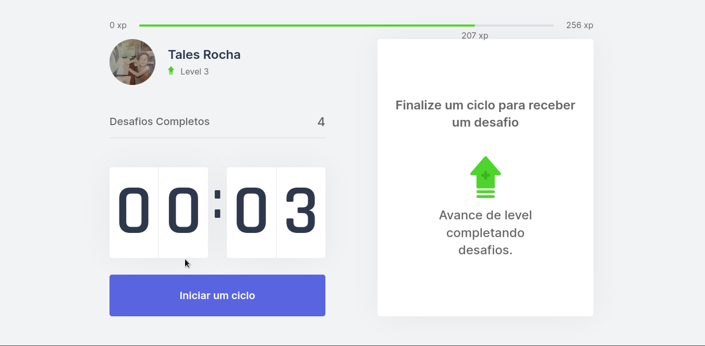

## About

![Product Name Screen Shot][product-screenshot]

Moveit is a high productivity platform to you achieve your goals. It's inspired in the pomodoro method and it adds physical tasks for the user wellbeing.<br />

<p align="right">(<a href="#readme-top">back to top</a>)</p>

### Built With

* [![Next][Next.js]][Next-url]

<p align="right">(<a href="#readme-top">back to top</a>)</p>

<!-- GETTING STARTED -->
## Getting Started

To get a local copy up and running follow these simple example steps.

### Installation

1. Clone the repo
   ```sh
   git clone https://github.com/taleshrocha/move-it.git
   ```
2. Install yarn packages
   ```sh
   yarn install
   ```

<p align="right">(<a href="#readme-top">back to top</a>)</p>

<!-- USAGE EXAMPLES -->
## Usage

Run the application in localhost with
   ```sh
   yarn dev
   ```
   
It will look something like this:



<p align="right">(<a href="#readme-top">back to top</a>)</p>

<!-- LICENSE -->
## License

Distributed under the MIT License. See `LICENSE` for more information.

<p align="right">(<a href="#readme-top">back to top</a>)</p>

<!-- ACKNOWLEDGMENTS -->
## Acknowledgments

This project was possible by [Rocketseat](https://www.rocketseat.com.br/) Next Level Week 4.

<p align="right">(<a href="#readme-top">back to top</a>)</p>

<!-- REFERENCES -->
[product-screenshot]: images/screenshot.png

[contributors-shield]: https://img.shields.io/github/contributors/taleshrocha/move-it.svg?style=for-the-badge
[contributors-url]: https://github.com/taleshrocha/move-it/graphs/contributors
[forks-shield]: https://img.shields.io/github/forks/taleshrocha/move-it.svg?style=for-the-badge
[forks-url]: https://github.com/taleshrocha/move-it/network/members
[stars-shield]: https://img.shields.io/github/stars/taleshrocha/move-it.svg?style=for-the-badge
[stars-url]: https://github.com/taleshrocha/move-it/stargazers
[issues-shield]: https://img.shields.io/github/issues/taleshrocha/move-it.svg?style=for-the-badge
[issues-url]: https://github.com/taleshrocha/move-it/issues
[license-shield]: https://img.shields.io/github/license/taleshrocha/move-it.svg?style=for-the-badge
[license-url]: https://github.com/taleshrocha/move-it/blob/master/LICENSE.txt

[linkedin-shield]: https://img.shields.io/badge/-LinkedIn-black.svg?style=for-the-badge&logo=linkedin&colorB=555
[linkedin-url]: https://linkedin.com/in/linkedin_username

[Next.js]: https://img.shields.io/badge/next.js-000000?style=for-the-badge&logo=nextdotjs&logoColor=white
[Next-url]: https://nextjs.org/
[React.js]: https://img.shields.io/badge/React-20232A?style=for-the-badge&logo=react&logoColor=61DAFB
[React-url]: https://reactjs.org/
